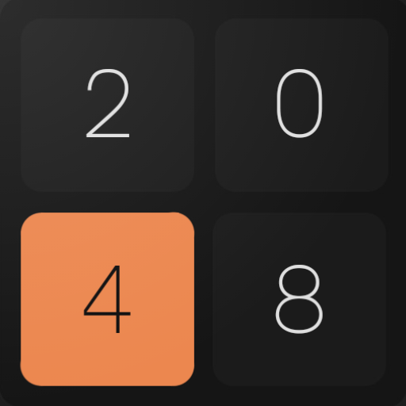
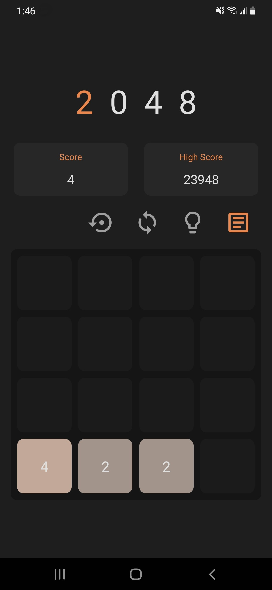
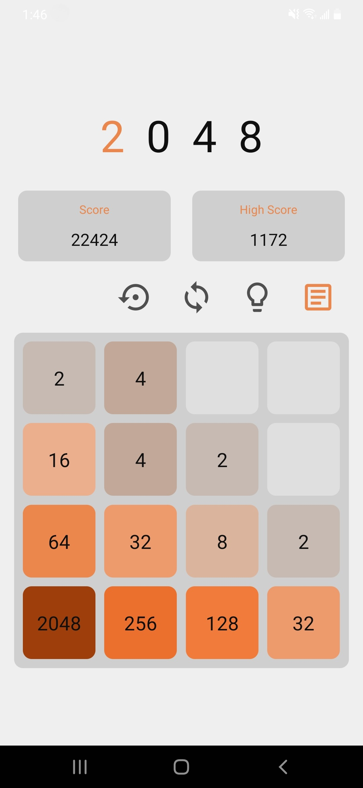
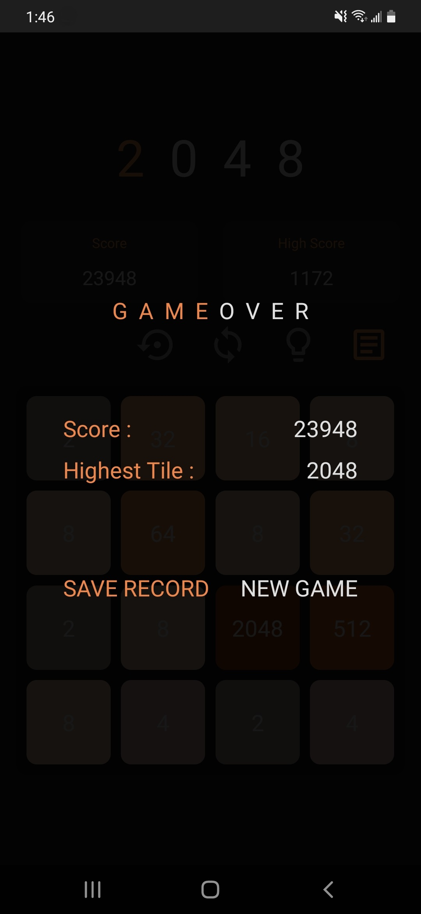
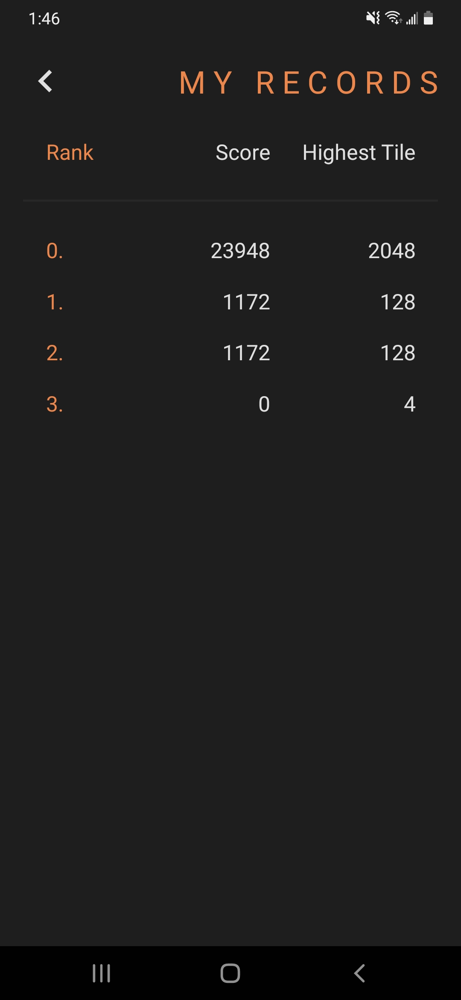

# RN2048

## Background

In the evening of the 25th May, 2021, I decided to task myself with a 4-day weekend build. I wanted to learn how to use the react-native-gesture-handler package and I decided to code the game 2048 with typescript React Native.

This project took all 4 days, or effectively, 20 or so hours to complete. Days 1 and 2 were spent developing the game's main algorithm, day 3 was spent debugging and refining the code, and the final day was used to style, refactor, document, and release everything.

## Technical Details

This app consists of 2 pages, the main game page and a record page which displays all the games the user decides to save.

Due to time concerns, animated movement for the tile on the grid have not been implemented. But this could be done with react-native-reanimated or other similar packages.

### Libraries Used

Below is a list of all the node packages used for the project (React Native base packages **EXCLUDED**)
- react-native-gesture-handler
- react-native-modal
- react-native-vector-icons
- react-navigation (and all of its subsequent packages)
    - the stack navigation package
- redux (and all of its subsequent packages)
    - react-redux
    - redux-persist
        - react-native-async-storage

## Gallery

Below are some screenshots of the app (Android)

|       Game Screen (Dark)        |       Game Screen (Light)        |         Gameover Popup Screen         |            Record Screen            |
| :-----------------------------: | :------------------------------: | :-----------------------------------: | :---------------------------------: |
|  |  |  |  |

## Maintenance and Future Updates

As of now, there are no plans to maintain nor further develop this project, as this is only a weekend sprint build.

Although there is no incentive to do so, the way the app is coded is prepared for further expansion, such as different sized boards. The algorithms were developed to be able to handle boards of all sizes. Adding new screens to accomodate for board size selection would also be easy as screen components are extracted and abstracted from the navigator itself.

But for those curious people out there who wishes to give it a test, a release .apk is attached in the release page of this repo.
